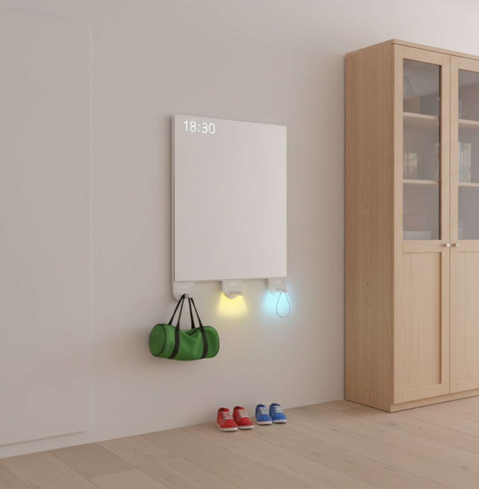

# Projecttitel
*Project Lethe, een slimme kapstok die kinderen helpt om hun hobby zakken te maken.* 

🛠️ Built by ``Hanne Dierickx`` & ``Otto Vandroogenbroeck``   
🔥 Supervised by ``prof. dr. Bas Baccarne``, ``Yannick Christiaens`` & ``Wouter Devriese``    
🌱 Grown at ``Ghent University`` 🏛️ ``Industrial Design Engineering`` ([project overview](https://github.com/basbaccarne/human-centered-design))       

*18/12/2025*   

## Samenvatting
Project Lethe is een product gemaakt om stress te verminderen bij jonge gezinnen.
De rush wanneer er vertrokken moet worden naar school of naar een hobby is universeel. Het is een moment wanneer ouders niet alleen zichzelf maar ook de kinderen en eventuele zakken klaar moeten krijgen. Om dit te verhelpen voerden we interviews en user tests uit bij gezinnen met kinderen in het lager onderwijs. Met als resultaat project Lethe.
Lethe de slimme kapstok, zorgt ervoor dat er nooit nog een zak vergeten wordt.
Ze doet dit door de kinderen zelf hun zakken te laten maken. De kapstok is verbonden met een app, waar de ouders de activiteiten van hun kinderen kunnen ingeven. Zo weet de kapstok, wie wanneer welke hobby heeft. En zal de kinderen op voorhand op trommelen om hun zak te komen maken. Doormiddel van een interactief touchscreen zien de kinderen wat er in de desbetreffende zak moet komen. Zit alles in de zak, en hangt die aan de kapstok, dan zegt Lethe, dankjewel en is er weer wat stress vermeden.

  

## Introductie
Onderzoek toont aan dat vaste routines een positieve invloed hebben op de ontwikkeling van kinderen. Ze dragen bij aan een gezonde levensstijl, waaronder slaapkwaliteit, eetpatroon en sociaal-emotionele ontwikkeling (Bost et al., 2013)[^1]. Om deze voordelen te realiseren, worden ouders aangemoedigd om kinderen zelfstandigheid en verantwoordelijkheid bij te brengen in dagelijkse taken, zoals school- en hobbyactiviteiten (Selman & Dilworth-Bart, 2023)[^2].

Uit eigen interviews met ouders (N=3) bleek dat zij deze zelfstandigheid wel willen stimuleren, maar dat dit tijdens stressvolle momenten, zoals de ochtendrush, moeilijk toepasbaar is. Onderzoek suggereert dat externe, neutrale hulpmiddelen de communicatie tussen ouder en kind kunnen ondersteunen tijdens dergelijke momenten (Chan et al., 2017)[^3]. Aanvullend marktonderzoek (N=10) toonde echter aan dat er momenteel geen product bestaat dat hier specifiek op inspeelt voor jonge gezinnen.

Vanuit deze vaststelling ontstond Project Lethe: een slimme, interactieve kapstok die kinderen ondersteunt in het zelfstandig voorbereiden van school- en hobbytassen, met als bijkomend effect een vermindering van stress bij de ouders.

De gehanteerde boundary conditions zijn:
>•	betaalbaar voor jonge gezinnen;
•	verantwoordelijkheid en actie bij het kind;
•	eenvoudig en intuïtief in gebruik.

## Inhoudstafel

1. [Methodologie](./docs/methodologie.md)
2. [Discovery](./docs/discovery.md)
3. [Defintion](./docs/definition.md)
4. [Design Requirements](./docs/design_requirements.md)
5. [Bill of materials](./docs/bom.md)

## Kritische reflectie
Max. 500 woorden

## Noot inzake het gebruik van AI
Licht toe op welke manier je AI gebruikte in dit project.

## Bijlagen
### Discovery
* Benchmarkonderzoek (N=10)
  * [Protocol](./docs/Protocol%20benchmarking.pdf)
  * [Rapport](./docs/Rapport%20benchmarking.pdf)
* Interviews (N=3)
  * [Protocol](./docs/Protocol%20user%20interview.pdf)
  * [Rapport](./docs/Rapport%20user%20interview.pdf)
    
### Definition
* User testing wave 1 (N=2)
  * [Protocol](./docs/Concept%20testing%20wave%201%20-%20protocol.pdf)
  * [Rapport](./docs/concept%20testing%20wave%201%20-%20report.pdf)
* User testing wave 2 (N=4)
  * [Protocol](./docs/Concept%20testing%20wave%202%20-%20protocol.pdf)
  * [Rapport](url)

## Licentie
This repository contains both software and design materials created as part of an industrial design energineering project at Ghent University.

- **Software and code:** [MIT License](./LICENSE-MIT)  
- **Design, documentation, CAD, and media:** [CC BY 4.0 License](./LICENSE)
  
You are free to reuse and build upon this work, both commercially and non-commercially, as long as proper attribution is given to the original authors.

## Bronnen
 [^1]: Bost, K. K., Wiley, A. R., Fiese, B., Hammons, A., & McBride, B. (2013). Associations between adult attachment style, emotion regulation, and preschool children’s food consumption. Journal of Developmental & Behavioral Pediatrics, 35(1), 50–61. https://doi.org/10.1097/01.dbp.0000439103.29889.18
 
 [^2]: Selman, S. B., & Dilworth‐Bart, J. E. (2023). Routines and child development: A systematic review. Journal of Family Theory & Review, 16(2), 272–328. https://doi.org/10.1111/jftr.12549

 [^3]: Chan, M., Lin, Y., Lin, L., Lin, T., Hsu, W., Chang, C., Liu, R., Chang, K., Lin, M., & Hsu, J. Y. (2017). WAKEY. CSCW ’17: Proceedings of the 2017 ACM Conference on Computer Supported Cooperative Work and Social Computing, 2287–2299. https://doi.org/10.1145/2998181.2998233

