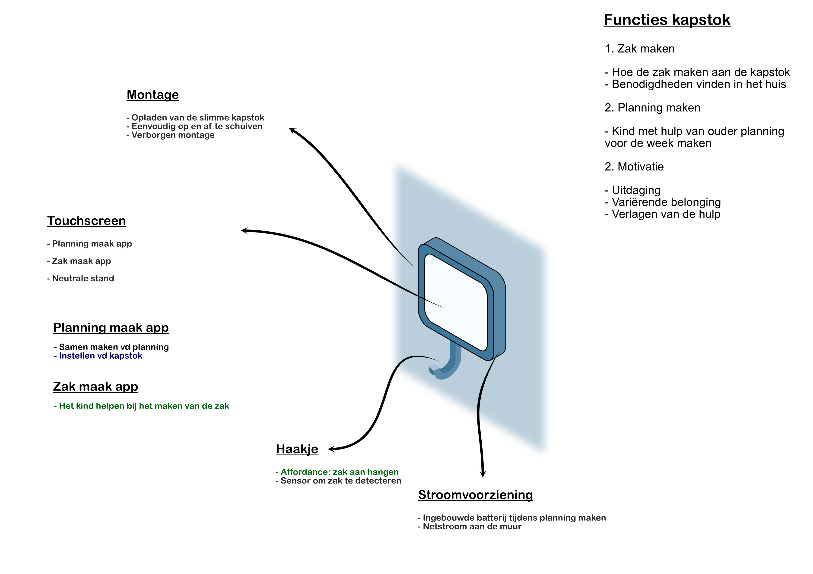
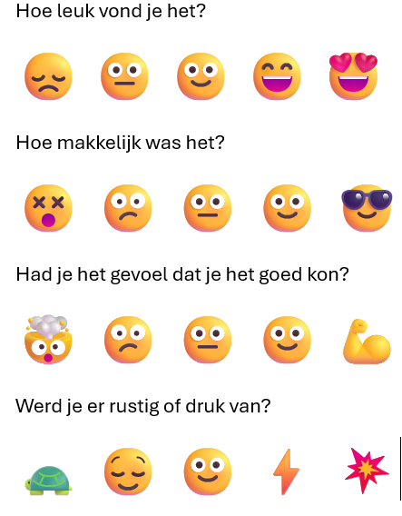

# Develop 1
## Inleiding
Deze fase werd uitgevoerd in de eerste vier weken van het tweede semester. Er werd hoofdzakelijk onderzoek gedaan naar een pedagogisch kader om dit project in te nestelen. 

- Literatuurstudie omtrent pedagogie
- Expert interview met master studente pedagogie `Lize Dierickx, UGent`
- Functie analyse
- Task based benchmark testing (N=4)
## Literatuuronderzoek pedagogie
Om vat te krijgen op de cognitieve processen die een kind doorloopt bij het aanleren van nieuwe handelingen, werd er onderzoek gedaan naar pedagogische psychologische frameworks.
Op deze pagina zullen er een aantal frameworks kort besproken worden die toegepast kunnen worden op project Lethe, telkens met een kind als protagonist.
[📃Literatuuronderzoek ](../docs/Literatuuronderzoek_pedagogie.md)
### Implicaties op ons ontwerp

  

## Expert interview 
Om nog meer grip te krijgen op het pedagogische kader achter dit product, werd er een expert interview gedaan. `Lize Dierickx` master studente pedagogische wetenschappen aan de Ugent, gaf in een online interview haar visie op project Lethe.

[📃Protocol Expert interview ](../reports%20and%20protocols/Protocol_expert%20interview.pdf) [📑Rapport Expert interview ](../reports%20and%20protocols/Rapport_expert%20interview.pdf)

## Functie analyse
Na feedback werd er beslist om een uitgewerktere functie analyse op te stellen. Deze heeft als doel om op een grafische manier alle functies, componenten en verbindingen tussen alle aspecten van het product weer te geven.

  

## Task based benchmark testing
Deze test had als doel inzicht te krijgen in hoe een ouder met een kind samen een planning maakt. Hiervoor werd gebruik gemaakt van drie benchmark planningsapplicaties en een zelfgemaakte app. Alle apps werden theoretisch geanalyseerd. Die theoretische analyses en resultaten uit het onderzoek zullen worden gebruikt om onze applicatie uit te ontwikkelen.

De theoretische analyse kan hier teruggevonden worden:
[📃Analyse benchmark apps ](../docs/Analyse_Planningsapps.pdf)
### Test protocol
[📃Protocol benchmark testing ](../reports%20and%20protocols/Protocol_Benchmark_testing.pdf)
De testen werden telkens uitgevoerd met een ouder en een kind. 

__1. Planning maken op papier:__ er werd gevraagd om op een afgeprinte agenda alle activiteiten voor de week te schrijven die zij zouden willen dat de kapstok weet.

__2. Planning op de app:__ nadien werd er gevraagd om de planning te maken op de 4 app's. _Er werd geen onderscheid gemaakt tussen de benchmarks en de figma app._

__3. SAM-evaluatie:__ na elke app werd er een korte SAM evaluatie ingevuld door de ouder en het kind.

__4. Nabespreking:__ na de testen werd er tijd gemaakt om kwalitatief onderzoek te doen aan de hand van open vragen. Hierbij werden ook de bevindingen van deze test meegedeeld met de test personen.

  

### Test resultaten
[📑Rapport benchmark testing ](../reports%20and%20protocols/Rapport_enchmarktesting.pdf)

| ID  | Design requirement                                                                  | Voorbeeld app               |
|-----|-------------------------------------------------------------------------------------|-----------------------------|
| 4.1 | Het programma moet op een overzichtelijke manier en volgorde alle user input vragen | Unicorn kalender, Figma app |
| 4.2 | Het programma mag geen afleidingen creëren                                          | Figma app                   |
| 4.3 | De app moet een visueel leuke achtergrond hebben (volgens een thema)                | Unicorn kalender            |
| 4.4 | Het kind moet actief meewerken aan het planning maken                               | Unicorn kalender, Figma app |
| 4.5 | Typen moet worden vermeden om zo inclusief mogelijk te zijn                         | Figma app                   |
| 4.6 | De planning moet een duidleijk overzicht van de week geven                          | Weeklo, Figma               |
