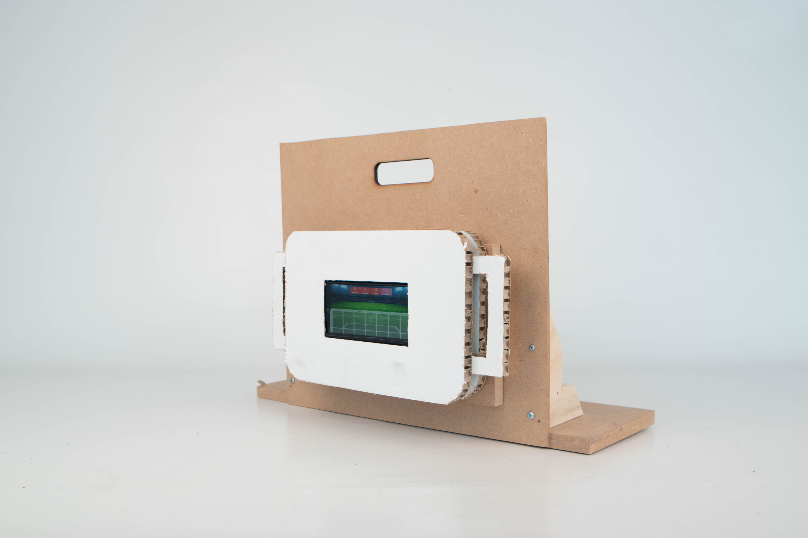
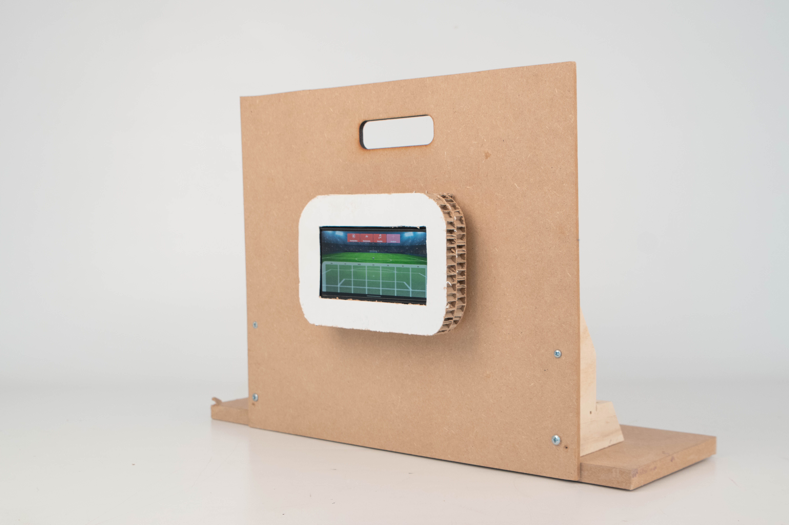
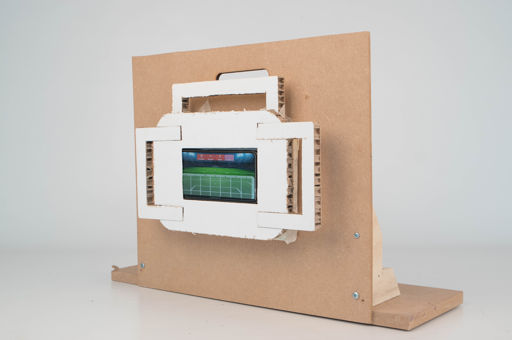
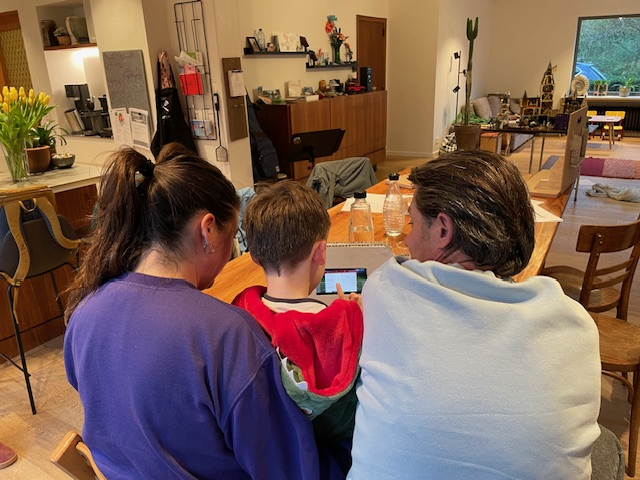
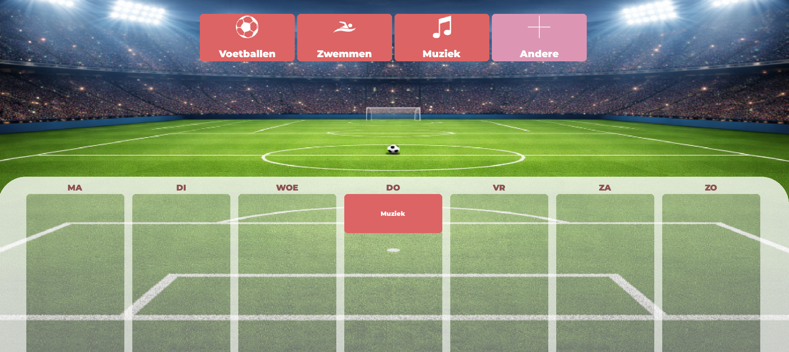
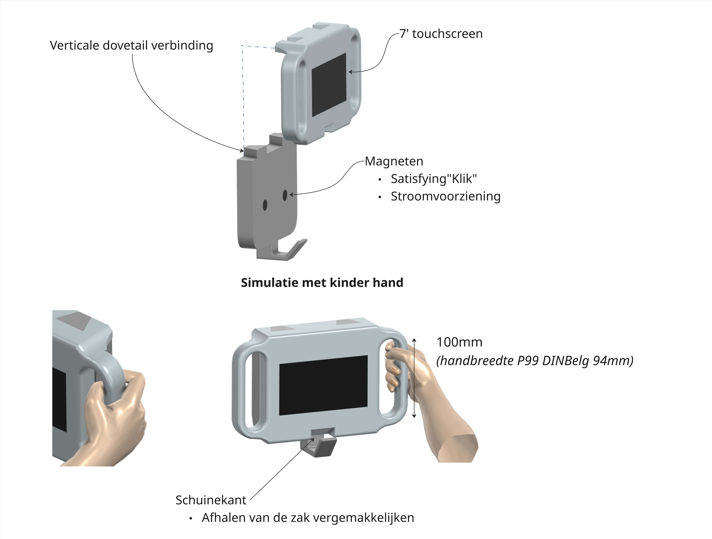

# Develop 2
## Inleiding
In deze fase werd er hoofdzakelijk onderzoek gedaan naar de ergonomie en de fysieke vorm van de kapstok. Hiervoor moest eerst het bevestigingssyteem en het type handvaten bepaald worden. Ook de planningapp werd verder uitgewerkt in pygame aan de hand van usability goals, die tijdens de user testing werden geëvalueerd. 

- Long neck analyse en usability goals
- Benchmark onderzoek naar losmakende verbindingenssystemen
- Task based testing (N=4)

### Long neck analyse
Uit het story board werden de voornaamste acties met het product geanalyseerd en gecategoriseerd naar mate van voorkomen.

  

### Usability goals
| Doel                                                                                                                              | Meten                | Type                          |
|-----------------------------------------------------------------------------------------------------------------------------------|----------------------|-------------------------------|
| Kinderen (vanaf de derde kleuterklas) moeten de kapstok binnen 5 seconden volledig zelfstandig van de muur kunnen halen.          | Timen                | efficiency                    |
| Kinderen (vanaf de derde kleuterklas) moeten de kapstok binnen 5 seconden volledig zelfstandig correct aan de muur kunnen hangen. | Timen                | efficiency                    |
| Het kind moet samen met de ouder de weekplanning binnen maximaal 10 minuten kunnen maken.                                         | Timen                | efficiency                    |
| Kinderen (vanaf de derde kleuterklas) moeten de informatie op de kapstok correct kunnen interpreteren zonder uitleg.              | Think aloud protocol | learnability / effectiveness  |

## Benchmark onderzoek 
Op basis van de usability goals bleek dat het ophangsysteem verder onderzocht moest worden. Er werd gestart met een benchmarkonderzoek van 10 systemen. Hieruit werden drie veelbelovende opties geselecteerd voor verdere testing:
-	Groot verticaal schuifsysteem 
-	Verticale dovetail 
-	Magnetische strip

<table>
  <tr>
    <th></th>
    <th>Gemakkelijk losneembaar</th>
    <th>Gemakkelijk terug te bevestigen</th>
    <th>Draagkracht</th>
    <th>stabiel</th>
    <th>Hoeveelhied plaats nodig</th>
    <th>Instelbaar in hoogte</th>
  </tr>

  <tr>
    <td>Klein verticaal schuifsysteem</td>
    <td style="background-color:yellow">+-</td>
    <td style="background-color:yellow">+-</td>
    <td style="background-color:yellow">+-</td>
    <td style="background-color:lightgreen">+</td>
    <td style="background-color:green; color:white">++</td>
    <td>Nee</td>
  </tr>

  <tr>
    <td>Groot verticaal schuifsysteem</td>
    <td style="background-color:lightgreen">+</td>
    <td style="background-color:lightgreen">+</td>
    <td style="background-color:green; color:white">++</td>
    <td style="background-color:green; color:white">++</td>
    <td style="background-color:green; color:white">++</td>
    <td>Nee</td>
  </tr>

  <tr>
    <td>Aan buis haken</td>
    <td style="background-color:green; color:white">++</td>
    <td style="background-color:green; color:white">++</td>
    <td style="background-color:green; color:white">++</td>
    <td style="background-color:red; color:white">--</td>
    <td style="background-color:lightgreen">+</td>
    <td>Nee</td>
  </tr>

  <tr>
    <td>Zuignappen</td>
    <td style="background-color:lightgreen">+</td>
    <td style="background-color:green; color:white">++</td>
    <td style="background-color:red; color:white">--</td>
    <td style="background-color:yellow">+-</td>
    <td style="background-color:green; color:white">++</td>
    <td>Ja</td>
  </tr>

  <tr>
    <td>Horizontaal schuifsysteem</td>
    <td style="background-color:lightgreen">+</td>
    <td style="background-color:lightgreen">+</td>
    <td style="background-color:green; color:white">++</td>
    <td style="background-color:green; color:white">++</td>
    <td style="background-color:yellow">+-</td>
    <td>Nee</td>
  </tr>

  <tr>
    <td>In elkaar passen</td>
    <td style="background-color:green; color:white">++</td>
    <td style="background-color:yellow">+-</td>
    <td style="background-color:orange">-</td>
    <td style="background-color:lightgreen">+</td>
    <td style="background-color:green; color:white">++</td>
    <td>Nee</td>
  </tr>

  <tr>
    <td>Ophangbord dubbele haak</td>
    <td style="background-color:lightgreen">+</td>
    <td style="background-color:lightgreen">+</td>
    <td style="background-color:green; color:white">++</td>
    <td style="background-color:green; color:white">++</td>
    <td style="background-color:red; color:white">--</td>
    <td>Ja</td>
  </tr>

  <tr>
    <td>Velcro</td>
    <td style="background-color:yellow">+-</td>
    <td style="background-color:green; color:white">++</td>
    <td style="background-color:yellow">+-</td>
    <td style="background-color:green; color:white">++</td>
    <td style="background-color:green; color:white">++</td>
    <td>Nee</td>
  </tr>

  <tr>
    <td>Verticale dovetail</td>
    <td style="background-color:lightgreen">+</td>
    <td style="background-color:lightgreen">+</td>
    <td style="background-color:green; color:white">++</td>
    <td style="background-color:green; color:white">++</td>
    <td style="background-color:green; color:white">++</td>
    <td>Nee</td>
  </tr>

  <tr>
    <td>Magnetische strip</td>
    <td style="background-color:green; color:white">++</td>
    <td style="background-color:green; color:white">++</td>
    <td style="background-color:lightgreen">+ (sterke magneten gebruiken)</td>
    <td style="background-color:green; color:white">++</td>
    <td style="background-color:green; color:white">++</td>
    <td>Nee</td>
  </tr>

</table>

[📃Protocol benchmark onderzoek ](../docs/Protocol%20Benchmark%20ophangsysteem.pdf)
[📃Rapport benchmark onderzoek ](../docs/Rapport%20Benchmark%20ophangsysteem.pdf)

## Task based testing (N=4)
Gebruikerstesten werden uitgevoerd bij twee gezinnen thuis. De test had drie grote delen:
- Ergonomie testen van het bevestigen van de kapstok
- Usability testen van de planningsapp
- Cocreatie van de kapstok haak

[📃Protocel task based testing ](../docs/Protocol_ophangsysteem_testing.pdf)
[📃Rapport task based testing ](../docs/Rapport_ophangsysteel_testing.pdf) 

### Bevestigingssysteem, hadnvaten en grootte
Er werd een draagbare wand gemaakt waarop de drie bevestigingsmethodes bevestigd konden worden. Alle prototypes werden gemaakt uit karton platen. Ieder prototype had telkens een variatie in afmeting en type handvaten. De kinderen kregen telkens een bevestigingssysteem met dezelfde taken:

**1.**	De kapstok te bevestigen 
**2.**	De kapstok los te nemen
**3.**	Een korte wandeling te maken met de kapstok 

Na ieder prototype werd door de kinderen een SAM vragenlijst in gevuld om te polsen naar de gebruiksvriendelijkheid.

  
  
  

**Resultaten:**
-	De magnetische strip en verticale dovetail scoorden gelijkaardig. 
-	Handvaten waarbij de hand volledig rond het handvat kan, werd als beter en eenvoudiger aanzien door de kinderen. 
-	De kinderen verkozen de twee kleinste prototypes, de lege ruimte rond het scherm wordt als *"onnodig"* aanzien.

### App
De kinderen kregen de opdracht om met de hulp van een ouder hun weekplanning te maken in de nieuwe app. 
Nadien werden de kinderen nog gevraagd om een activiteit te verwijderen. 

**Resultaten:**
- Het slepen van de activiteiten werd niet getriggerd
- De annuleer knop bij het planningmaken werd per ongeluk getriggerd terwijl de klok werd ingesteld.

*Meer info is te vinden op pagina 8*[📃Rapport task based testing ](../docs/Rapport_ophangsysteel_testing.pdf)

  

### Kapstokhaak
Aanvullend werd een korte test uitgevoerd met betrekking tot het mentale model van kinderen omtrent een kapstokhaak. De prototypes bevatte geen haakje, er werd gevraagd aan de kinderen om er zelf één te tekenen. De resulterende tekeningen vertoonden een sterke onderlinge gelijkenis, wat duidt op een gedeeld mentaal model van de visuele representatie van een kapstokhaak.

  

## Vormkeuze
Alle resultaten werden samengebracht en dienden als basis voor de selectie van de vorm waarmee verder wordt gegaan. Het ontwerp wordt zo compact mogelijk gehouden, waarbij het scherm en de handvaten voldoende groot blijven voor comfortabel gebruik.
De afmetingen van de handvaten werden bepaald aan de hand van het principe **design for the tall**. Als referentiemaat werd de handgrootte van een volwassene gehanteerd, zodat zowel ouders als opgroeiende kinderen de kapstok zonder moeite kunnen dragen. Dit resulteerde in een minimale **hoogte van 94 mm.**

*Ik moet de foto nog annoteren het komt er aan hahah*

  

